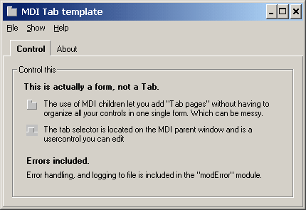



## Tab Mdi application

### Description

Tab Mdi application. A template for your application. Simulates a tabcontrol, but uses mdi forms for added managability. The tab control on top shows/hides your forms.
 
### More Info
 

             |
---                |---
**Submitted On**   |2004-10-23 21:36:46
**By**             |[Sivert Nilsen](https://github.com/Planet-Source-Code/PSCIndex/blob/master/ByAuthor/sivert-nilsen.md)
**Level**          |Beginner
**User Rating**    |4.4 (22 globes from 5 users)
**Compatibility**  |VB 6\.0
**Category**       |[Complete Applications](https://github.com/Planet-Source-Code/PSCIndex/blob/master/ByCategory/complete-applications__1-27.md)
**World**          |[Visual Basic](https://github.com/Planet-Source-Code/PSCIndex/blob/master/ByWorld/visual-basic.md)
**Archive File**   |[Tab\_Mdi\_ap18099910252004\.zip](https://github.com/Planet-Source-Code/sivert-nilsen-tab-mdi-application__1-56919/archive/master.zip)

